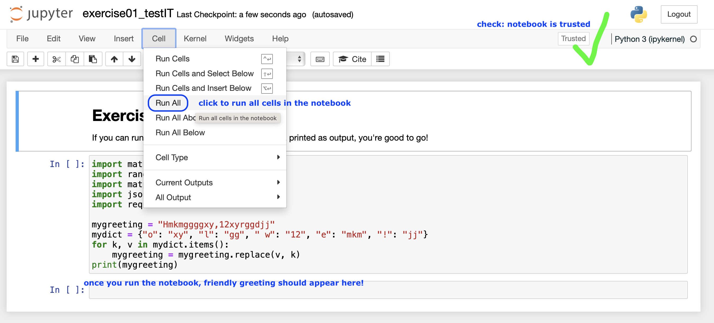

# Checklist for Exercise 01 (bootIT)

Exercise 01 is all about setting up a cozy coding environment on your machine. Brief checklist:

1. Install the sublime text editor
2. Install VS Code (or VS Codium)
3. Install an Anaconda distribution
4. Launch & run Jupyter notebook

Each step is explained in detail below.

**By the end of this exercise, you should know how to:**
- [ ] Open, in VS Code, a Jupyter notebook (`.ipynb` file format) that you downloaded from learnIT to your machine
- [ ] run separate code cells in a Jupyter notebook
- [ ] delete code outputs in the Jupyter notebook

## Step 1: Install the sublime text editor

Install the [sublime text editor](https://www.sublimetext.com). sublime is a simple text editor (much simpler than, for example, Microsoft Word). We will use it later in class.

## Step 2: Install VS Code

Install [Visual Studio Code](https://code.visualstudio.com). Or, alternatively, if you are a fan of open source, install [VS Codium](https://vscodium.com) instead. VS Code is a so-called IDE: an integrated development environment (fancy expression for "code editor"). In other words, this is the desktop software that we will use in class to code in Python.

## Step 3: Install Anaconda distribution

Install [Anaconda distribution](https://www.anaconda.com/docs/getting-started/installation). The Anaconda distribution contains basic Python (the programming language we will be learning), several additional Python packages ("extensions" for Python), and `conda`, a package manager for Python. 

On the website, select 
1. first your OS (operating system); 
2. then, Anaconda distribution; 
3. then, graphical installer. 

Once you're done, **verify that Anaconda has been installed correctly**, as described in the instructions on the website. If you need help finding your terminal (on macOS) or the Anaconda prompt window (on Windows), ask the TAs for help.

## Step 4: Launch & use Jupyter notebook

### Step 4a: Open up the jupyter notebook application - three ways!
We will work with jupyter notebooks (`.ipynb` file format) in this class. The jupyter notebook application is part of the Anaconda distrubution you installed in the previous step. There are 3 ways of opening up the jupyter notebook application. **Make sure you try out all three ways:**
* Through Anaconda Navigator, in your browser: go to the Anaconda Navigator, search for jupyter notebook, and click `Launch`
* Through VS Code: Open VS code and use the file browsing system to open up or create a jupyter notebook
* Through the command line interface (CLI): Open your CLI (see below), type `jupyter notebook` and press Enter. The notebook should then open in a browser window.

#### Note: How do I open up the CLI? 
* macOS & linux users: search for "Terminal" in your Applications
* Windows users: !! search for "Anaconda Prompt" in your Applications. (Do NOT use the preinstalled "Windows Terminal" application)

**Screenshot of the Jupyter Notebook app in a web browser**

    

### Step 4b: Open and run a downloaded jupyter notebook
1. Download the jupyter notebook [`exercise01_testIT.ipynb`](./exercise01_testIT.ipynb) to your machine, to the folder of your choice
2. Open up the jupyter notebook application with the method of your choice (step 4a)
3. Navigate to the folder where the jupyter notebook is stored, and open the notebook file
4. Run all cells in the notebook by clicking on `Cell > Run All`
5. If all worked well, you should receive a friendly greeting in the notebook.
6. Remove all output from the notebook, so that the friendly greeting is not visible anymore.
7. Now, try to run each cell separately.

#### Note: Make the notebook "trusted"
If in your browser, make sure that the notebook is "trusted" (the top right button should say "Trusted"; if it says "Not Trusted", click and confirm to make the notebook trusted) - see screenshot below.

**Screenshot of the testIT jupyter notebook**

    

